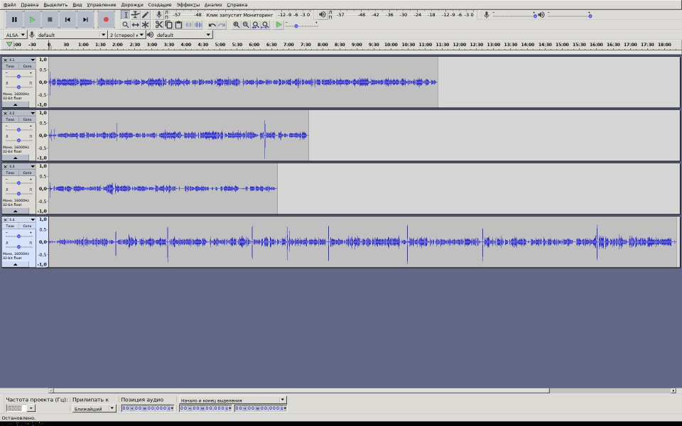
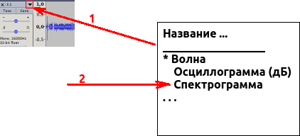
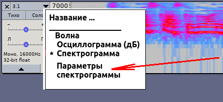
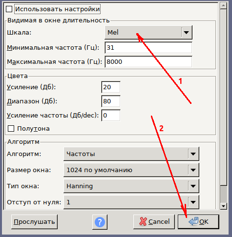

# Подготовка аудикниги из записанных на смартфоне фрагментов с помощью программы Audacity.

## Установка программы

[Вот](https://www.audacityteam.org/) ссылка на официальный сайт редактора. Редактор абсолютно бесплатный, и это легально.

## 1. Объединение фрагментов в единый файл.

Допустим, вы собираетесь смонтировать первую часть аудиокниги "Конёк-Горбунок".

> Если вдруг что-то пошло не так, всегда можно отменить последнее совершённое действие, нажав на клавиатуре ```<Ctrl> + <Z>```. Впрочем, это не относится к процедуре сохранения файлов.

После запуска нажмите ```<Ctrl> + <Shift> + <I>``` (импорт звукового файла). Выберите фрагменты, включающие себя части первй части "Конька-Горбунка". У меня это были 1.1.aac, 1.2.aac, 1.3.aac и 1.4.aac. Для того, чтобы выбрать несколько файлов, существуют клавиши ```Ctrl```(почтутно включить/исключить из выделения) и ```Shift```(выделить до указанного).

> Важно! Важно, чтобы импортированы фрагменты были в правильном порядке - сначала начало книги, потом продолжение и т.д. Так что, возможно, имеет смысл импортировать поштучно каждый фрагмент: т.е. несколько раз импортировать по одному файлую



Первым делом вам надо все эти фрагменты соединить в один большой, из которого потом уже будем вырезать всё лишнее:
* Двойным кликлм мышкой справа от нижней звуковой дорожки выделяем весь последний фрагмент (не по самой звуковой дорожке, а справа от неё).
* Выделенное копируем (копирование производится в "буфер обмена", т.е. во временную память компьютера). Для этого необходимо на клавиатуре нажать ```<Ctrl> + <C>```.
* Ставим курсор на конец предыдущей звуковой дорожки:
	* Подводишь курсор к вертикальной чёрной черте в конце звуковой дорожки. Вертикальная черта становится жёлтой.
	* В этом положении мыши кликаешь мышкой
* Нажмите на клавиатуре ```<Ctrl> + <V>```. Вот мы последний фрагмент добавили в конец предпоследнего фрагмента.
* Нажимаем на крестик в левом верхнем углу последней звуковой дорожки.
* Повторяем процедуру до тех пор, пока не останется одна-единственная (длинная) звуковая дорожка.

Перед тем, как сохранять, надо изменить представление звуковой дорожки с "Волна" на "Спектрограмма":




Теперь, когда у нас одна большая звуковая дорожка, сохраняем проект, нажимая на клавиатуре ```<Ctrl> + <S>```. При этом никакие звуковые файлы не модифицируются и не сохраняются - сохраняется только проект (набор звуковых дорожек, текущая позиция курсора в программе Audacity). Создаваемый файл должен иметь расширение ```.aup``` (т.е. так должно оканчиваться ео название).

## 2. sdf
